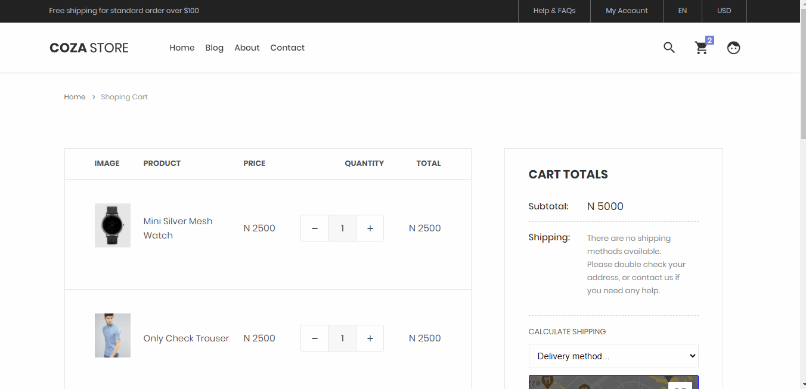
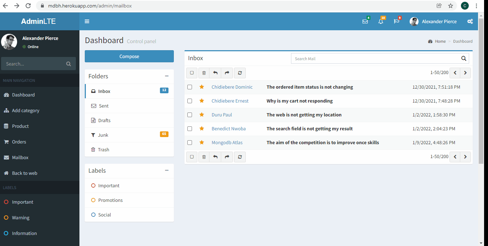

# E-commerce web app with Nodejs and MongoDB database

This is a solution to the [MongoDB Atlas Hackathon on DEV!](https://dev.to/devteam/announcing-the-mongodb-atlas-hackathon-on-dev-4b6m).

## Table of contents

- [MongoDB Atlas Search Features](#mongodb-atlas-search-features)
  - [Home page](#home-page)
  - [Checkout page](#checkout-page)
  - [Admin Mail page](#admin-mail-page)
- [Others](#others)
  - [Continued development](#continued-development)
  - [Useful resources](#useful-resources)
- [Links](#links)
- [Author](#author)

## MongoDB Atlas Search Features

I implemented the atlas search featues three places in the webpage

### Home page

I implemented autocomplete featues that will enable users search through the name and description, and added some awesome filters:


```js
const () => {
  console.log('The code is lengthy, you might wanna check the code on github😜')
}
```

### Checkout page

Here I implemented geowithin search to search for pickup store within approximately 3miles from the inserted location.

**Note: I added the input for longitude and latitude for testing porposes. It was supposed to get the users current location and search for the nearest store. Currently is not getting the users location because I used a free hosting plan and google map don't work on *"non secured"* site😢 and also  due to the fact that I don't have many saved location data, I added the input field**



```js
router.get("/searchstore", async (req, res) => {
	try {
		const arr = req.query.loc.split(",");
		const arrofno = arr.map(a => Number(a));

		let result = await Store.aggregate([
			{
				$search: {
					index: "storeac",
					geoWithin: {
						circle: {
							center: {
								type: "Point",
								coordinates: arrofno,
							},
							radius: 5000,
						},
						path: "address.location",
					},
				},
			},
		]);

		res.send(result);
	} catch (e) {
		if (e) {
			console.log(e);
		}
	}
});
```

### Admin Mail page

Here I repeated the atlas autocomplete search features, and added highlighting for easier referencing.



```js
router.get("/searchmail", async (req, res) => {
	try {
		let result = await Contact.aggregate([
			{
				$search: {
					index: "contactac",
					compound: {
						should: [
							{
								autocomplete: {
									query: `${req.query.term}`,
									path: "username",
									fuzzy: {
										maxEdits: 2,
									},
									score: { boost: { value: 3 } },
								},
							},
							{
								autocomplete: {
									query: `${req.query.term}`,
									path: "subject",
									fuzzy: {
										maxEdits: 2,
									},
									score: { boost: { value: 2 } },
								},
							},
							{
								autocomplete: {
									query: `${req.query.term}`,
									path: "email",
									fuzzy: {
										maxEdits: 2,
									},
								},
							},
							{
								autocomplete: {
									query: `${req.query.term}`,
									path: "message",
									fuzzy: {
										maxEdits: 1,
									},
								},
							},
						],
					},
					highlight: {
						path: ["username", "message", "email", "subject"],
					},
				},
			},
			{
				$addFields: {
					highlights: { $meta: "searchHighlights" },
				},
			},
		]);
		res.send(result);
	} catch (e) {
		res.status(500).send({ message: e.message });
	}
});
```

## Others

### Built with

- Nodejs
- Expressjs
- Mongodb

### Continued development

**Note: This E-commerce is not fully functional yet, I was just able to finish the atlas searches for now. I'll be adding other features later on...**

### Useful resources

- [MongoDB Atlas search docs](https://docs.atlas.mongodb.com/) - This helped me implement the atlas searches. I really liked the search pattern and will use it going forward.

## Links

- Github URL: [E-commerce](https://github.com/Ernest2026/E-commerce)
- Live Site URL: [E-commerce](http://mdbh.herokuapp.com)

## Author

- Github Profile: [@Ernesto](https://github.com/Ernest2026)
- Dev - [@Ernesto](https://dev.to/ernest2026)
- Twitter - [@Ernesto](https://www.twitter.com/Ernesto_tech)
- LinkedIn - [@Ernesto](https://www.linkedin.com/m/in/chidiebere-ernest-1078321ba)